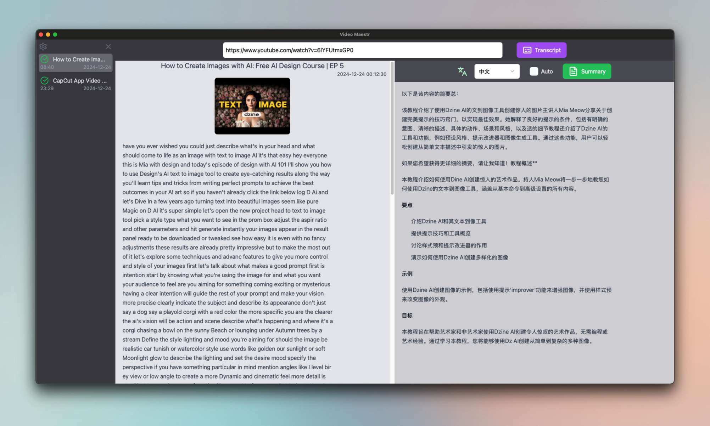
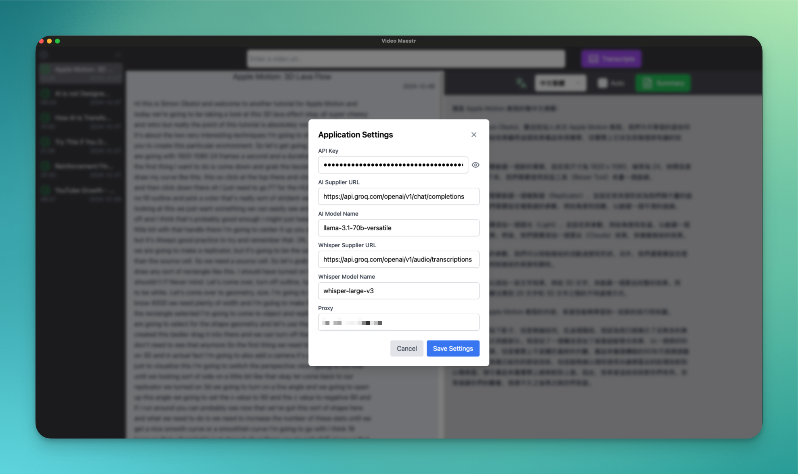

# 🎥 Video Maestro: Manage, Transcribe, Translate, Summarize! ✨

Welcome to Video Maestro! 🚀 (formerly known as Video Manager), your ultimate desktop app for managing and transforming video content from platforms like YouTube. Built with the power of Tauri 🦀 and ReactJS ⚛️, this app is a one-stop solution for creators, researchers, and enthusiasts.

> [!IMPORTANT]
> Video Maestro support youtube with/without subtitles. If the video has subtitles, then use subtitles by default, otherwise transform audio to transcripts first

## 📸 Screen Shot

<p align="center">
  
</p>

<p align="center">
  
</p>

## ✨ Features

### 📹 Video Management

- Easily import videos from YouTube or similar platforms.
- Organize videos in a clean and intuitive interface.

### 🔊 Audio to Text

- Extract audio from videos and transcribe it into accurate text.
- Supports multiple languages. 🌍

### 🌐 Translation & Summarization

- Translate transcriptions to other languages.
- Summarize lengthy content into concise points.

### 🎨 User-Friendly Interface

- Designed for efficiency and simplicity.
- Cross-platform support (Windows, macOS, Linux).

## 🛠️ Tech Stack

- Frontend: ReactJS ⚛️
- Backend: Tauri 🦀 (Rust-powered)
- Additional Tools: Advanced audio-to-text processing and translation APIs.

## 🚀 Get Started

### Requirements

- Node.js (for ReactJS development) 🌐
- Rust (for Tauri) 🦀
- pnpm (preferred package manager) 📦

### Installation

```bash
# Clone the repository
git clone https://github.com/bruceunx/video-maestro

# Navigate to the project directory
cd video-maestro

# Install dependencies
pnpm install

# Run the app in development mode
pnpm tauri dev
```

> [!NOTE]
> If you compile the app in local machine, it is fine!!!.
> If you download the app from github, you should encounter the error message like `The ..App is damaged and can not be opened ...`, try run the following command with admin authority

```bash
    sudo xattr -d com.apple.quarantine /Applications/video-maestr.app
```

## TODO

- [ ] add workflow to github
- [x] add Timeline to prompt for better Summarization
- [x] develop youtube parser to replace yt-dlp
- [x] use [rust-ffmpeg](https://github.com/CapSoftware/rust-ffmpeg) instead sidercar with ffmpeg
